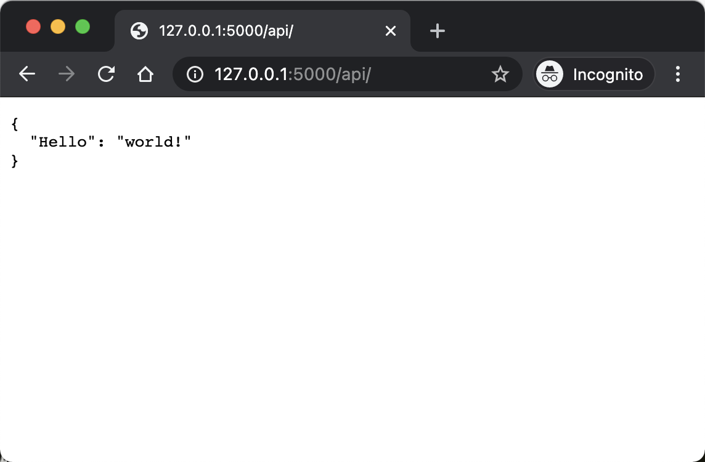

# Flask Api Structure

## This is my basic structure of flask api

1. > git clone git@github.com:cheng-huichao/flask-api-structure.git

2. > cd flask-api-structure

3. > python3 -m venv venv
    
4. >source venv/bin/activate
    
5. >pip install -r requirement.txt
   
6. > flask run
   
7. open http://127.0.0.1:5000/api/

---

## Development

 See [uwsig.ini](/uwsgi.ini) & [app.service](/app.service) for development.
 
 Feel free to use your own development methods ^_^.